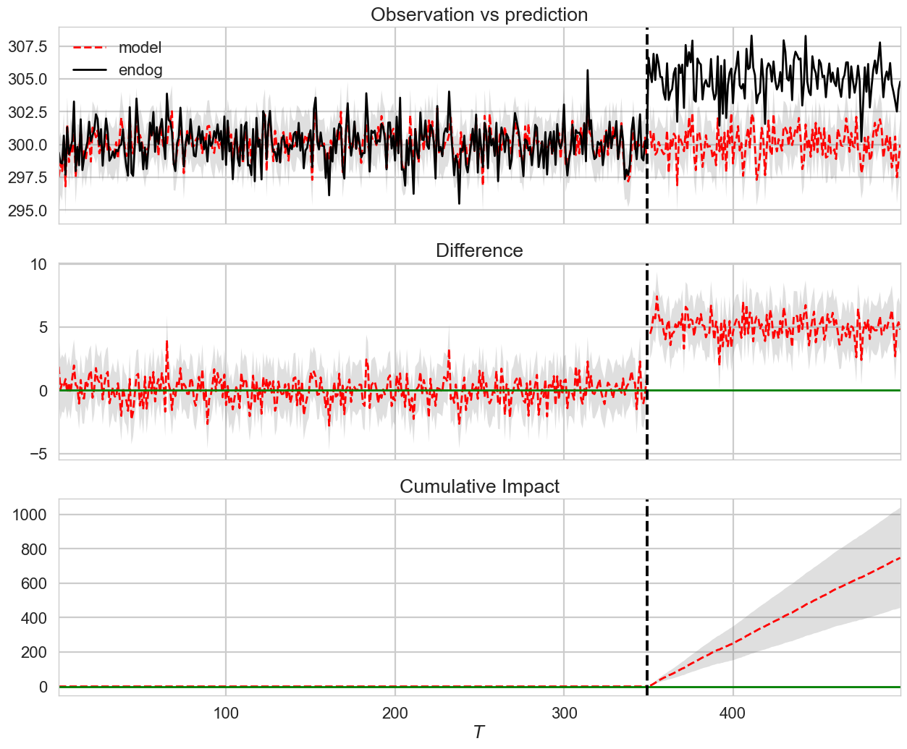

# Causal-Inference-with-Bayesian-Structural-Time-Series-Models
Applying Bayesian structural time series models to extract the causal impact of events on system evolution.

## Introduction

Structural time series are a type of state-space model. State-space models posit that the observations 
comprising a time series are a function of a hidden state that evolves over time via a Markov process 
depending on the previous state. A structural time series model assumes that the relationship between 
a state and the previous state and between states and observations take a particular functional form. 
The solution to these models is achieved through Kalman filtering, employing spike-and-slab priors 
for estimating regression coefficients and using Bayesian model averaging to integrate the solution 
components.

The  2015  paper from Google researchers communicates the details,

Brodersen, Kay H., Fabian Gallusser, Jim Koehler, Nicolas Remy, and Steven L. Scott. 
"Inferring causal impact using Bayesian structural time-series models." The Annals of 
Applied Statistics (2015): 247-274.

## Study 1

The Los Angeles Dodgers (LAD) have entered a golden era of winning as of September 2022. The 
Guggenheim Group bought the Dodgers from Frank McCourt in 2012 , approximately coinciding with 
the Dodgers latest rise to dominance. We want to use the tools of causal inference to quantify 
the impact ownership by the Guggenheim Group has had on total Dodger season wins. We use the total 
season wins by other MLB teams as control time series to predict the counterfactual for Dodger wins 
without a change in ownership in  2012  using a Bayesian structural time series model.

We start by visualizing the time series of season wins of the dodgers versus other major league 
teams in the same time period. We take the New York Mets (NYM) as a stand-in for other major league 
teams to simplify the visualization. We take the analysis only through the  2019  MLB season in order 
to avoid needing to account for the COVID-shortened  2020  season.

We perform the causal impact analysis on the last  30  seasons, 
with the final  8  seasons having the Dodgers under the ownership of the Guggenheim Group.

We generate a synthetic time series using the StatsModels library. We generate Autoregressive 
Moving Average (ARMA) model. The data models a weakly stationary stochastic time series process 
in terms of two polynomials, one for autoregression and one for moving average.

During the post-intervention period, the response variable had an average value of approx. 305. By contrast, in the absence of an intervention, we would have expected an average response of 300. The 95% interval of this counterfactual prediction is [298, 302]. Subtracting this prediction from the observed response yields an estimate of the causal effect the intervention had on the response variable. This effect is 5 with a 95% interval of [6, 3]. For a discussion of the significance of this effect, see below.

Summing up the individual data points during the post-intervention period (which can only sometimes be meaningfully interpreted), the response variable had an overall value of 45456. By contrast, had the intervention not taken place, we would have expected a sum of 44707. The 95% interval of this prediction is [44416, 44999]

The above results are given in terms of absolute numbers. In relative terms, the response variable showed an increase of 1.7%. The 95% interval of this percentage is [2.3%, 1.0%]

This means that the positive effect observed during the intervention period is statistically significant and unlikely to be due to random fluctuations. It should be noted, however, that the question of whether this increase also bears substantive significance can only be answered by comparing the absolute effect 5 to the original goal of the underlying intervention.

The probability of obtaining this effect by chance is very small (Bayesian one-sided tail-area probability 0.0). This means the causal effect can be considered statistically significant.